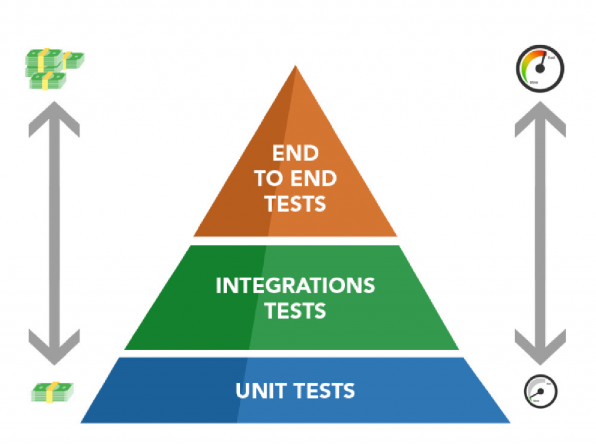

# Automatic Tests

## Inversion of Dependencies or IoC (Inversion of Control)

The principle of Inversion of Dependencies (IoC - Inversion of Control) is a software design that aims to invert the control of how the components of a system interact with each other. Instead of components directly controlling their dependencies, dependency inversion shifts that responsibility outside of the component. In summary, decouple business rules from infrastructure.

> _High-level modules should not depend on low-level modules. Both must depend on abstractions._
>
> _Abstractions should not depend on details. Details must depend on abstractions._
>
> _Robert C. Martin (2000)_:
>
> 
Robert C. Martin (2000)

## Test Types

- `Unit`
- `Integration`
- `End-to-End (E2E)`

## Test Driven Development (TDD)

