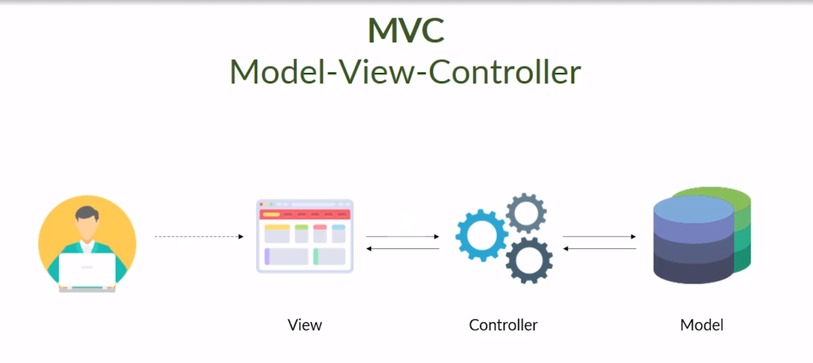

# Class 03 Controllers

## MVC Model

## HTTP Methods

HTTP verbs, also known as HTTP methods, are an essential part of the Hypertext Transfer Protocol (HTTP). They define the actions that a client can perform on a server. Here are some commonly used HTTP verbs:

- `GET`: Requests data from a specified resource.
- `POST`: Submits data to be processed to a specified
- `PUT`: Updates data on a specified resource.
- `DELETE`: Deletes the specified resource.
- `PATCH`: Applies partial modifications to a resource.

## HTTP response status codes

HTTP response status codes indicate whether a specific HTTP request has been successfully completed. Responses are grouped in five classes:

1. Informational responses (100 – 199)
2. Successful responses (200 – 299)
3. Redirection messages (300 – 399)
4. Client error responses (400 – 499)
5. Server error responses (500 – 599)

The status codes listed below are defined by RFC [9110](https://httpwg.org/specs/rfc9110.html#overview.of.status.codes).

## Links

- [Methods](https://developer.mozilla.org/en-US/docs/Web/HTTP/Methods)
- [Status-Code](https://developer.mozilla.org/en-US/docs/Web/HTTP/Status)
