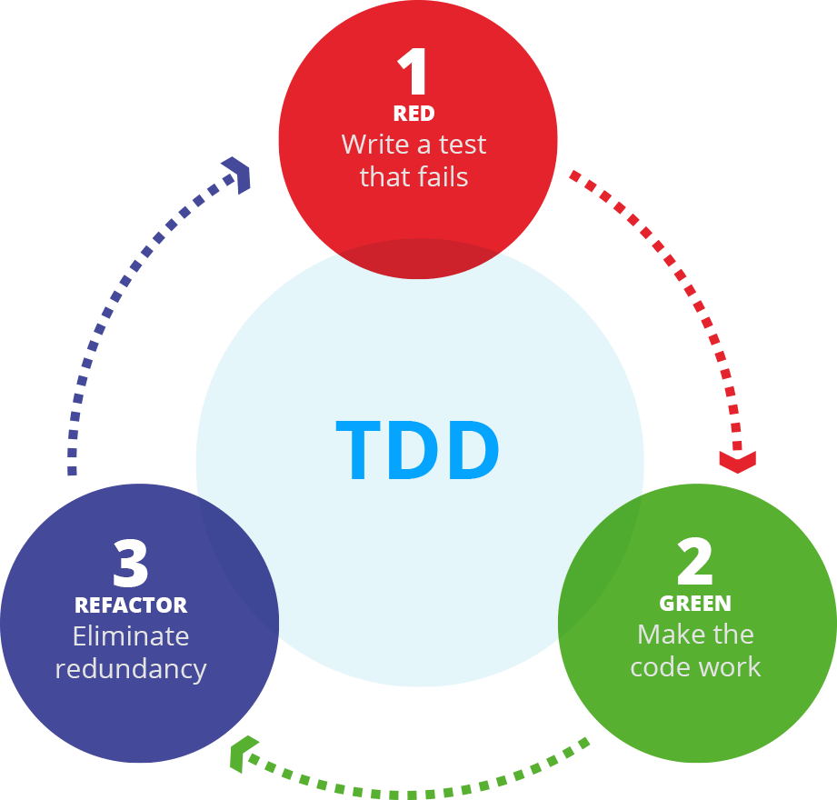

# Class 07 Automatic Tests

## Dependency Inversion Principle

The principle of Inversion of Dependencies (IoC - Inversion of Control) is a software design that aims to invert the control of how the components of a system interact with each other. Instead of components directly controlling their dependencies, dependency inversion shifts that responsibility outside of the component. In summary, decouple business rules from infrastructure.

> _High-level modules should not depend on low-level modules. Both must depend on abstractions._
>
> _Abstractions should not depend on details. Details must depend on abstractions._
>
> _Robert C. Martin (1996)_

The practice of using a folder called "repositories" and "services" to projects that follow the Dependency Inversion pattern is a common convention in many applications, especially those that follow a Clean Architecture or Layered Architecture.

## Here are some reasons why this convention is often adopted

- `Separation of Responsibilities`  
  The "repositories" folder is used to encapsulate the data access logic, isolating it from the rest of the application. This helps maintain a clear separation between data access concerns and the business logic of the application.

- `Ease of Maintenance`  
  Grouping all data access operations into a single folder makes these files easier to find and manage. This is especially useful in large projects where there may be a large number of SQL queries or database operations spread across multiple files.

- `Database Abstraction`  
  Repositories serve as an abstraction layer on top of the underlying database. This means that other parts of the application do not need to worry about database-specific details, such as SQL syntax or the type of database used. These details are encapsulated in the repositories, which makes it easier to replace or change the database in the future.

- `Testability`  
  Separating data access logic into repositories makes it easier to write unit tests for the rest of the application. Because repositories can be easily replaced with mock or stub versions during testing, this helps to isolate test units and ensure that they are not directly dependent on the real database.

- `Compliance with Software Design Principles`  
  This practice is aligned with SOLID principles, especially the Dependency Inversion Principle, which suggests that high-level modules should not depend on low-level modules, but rather both should depend on abstractions. Repositories, in this case, serve as abstractions for data access.

## Test Types


- `Unit`
- `Integration`
- `End-to-End (E2E)`

## Test Driven Development (TDD)



## JEST

Jest is a delightful JavaScript Testing Framework with a focus on simplicity.

It works with projects using: Babel, TypeScript, Node, React, Angular, Vue and more!

```bash
# install jest for tests
npm install --save-dev jest
```

```bash
# install jest types
npm i --save-dev @types/jest
```

```bash
# init jest configs
npm init jest@latest
```

```bash
# install ts-jest for types
npm install ts-jest -D
```

```bash
# install ts-node for types
npm install ts-node -D
```

#### JEST Config File

```ts
import type { Config } from "jest";

const config: Config = {
  preset: "ts-jest",
  testEnvironment: "node",
  bail: true,
  coverageProvider: "v8",
  verbose: false,
  testMatch: ["<rootDir>/src/**/*.{spec,test}.ts"],
};

export default config;
```

## Vitest

Vite's out-of-the-box support for common web patterns, features like glob imports and SSR primitives, and its many plugins and integrations are fostering a vibrant ecosystem. Its dev and build story are key to its success. For docs, there are several SSG-based alternatives powered by Vite. Vite's Unit Testing story hasn't been clear though. Existing options like Jest were created in a different context. There is a lot of duplication between Jest and Vite, forcing users to configure two different pipelines.

```bash
# install vitest for tests
npm install vitest -D
```

#### Vitest Configuration

```ts
import { defineConfig } from "vitest/config";

export default defineConfig({
  test: {
    // ...
  },
});
```

#### Scripts

```json
{
  "scripts": {
    "test": "vitest",
    "coverage": "vitest run --coverage"
  }
}
```

## Links

- [jest](https://jestjs.io/)
- [vitest](https://vitest.dev/)
